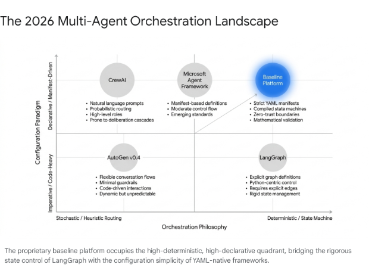
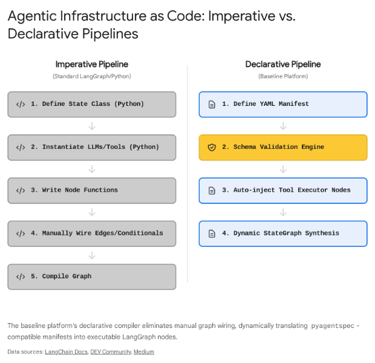
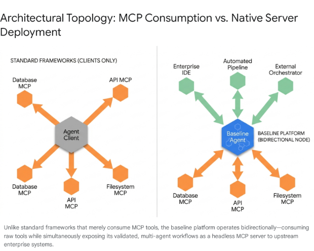

# **Strategic Comparative Analysis of Headless Agent Development Platforms and Multi-Agent Orchestrators**

## **The 2026 Agentic Ecosystem Landscape**

As artificial intelligence systems transition from simple conversational interfaces to autonomous, long-horizon task executors, the architectural paradigms governing multi-agent systems have fundamentally shifted. By mid-2026, the software engineering industry has largely abandoned monolithic, prompt-heavy application wrappers in favor of headless, opinionated, project-oriented agent factories1. Frameworks such as LangGraph, the Microsoft Agent Framework (formerly Semantic Kernel and AutoGen), and CrewAI have matured into enterprise-grade orchestrators, each championing distinct structural philosophies ranging from role-based heuristic delegation to deterministic directed acyclic graphs4.  
This comparative analysis evaluates a proprietary baseline platform against the prevailing open-source and enterprise frameworks. The baseline system is characterized by five core architectural differentiators: a Zero-Trust Epistemic Firewall ensuring cryptographic data provenance, YAML-compiled LangGraph state machines leveraging progressive disclosure, mathematical Maker-Checker pipelines for deterministic validation, a native Model Context Protocol server deployment architecture, and absolute multi-surface parity across diverse network interfaces. This evaluation isolates specific structural gaps in competing platforms, demonstrating where deterministic boundaries and protocol-native architectures provide a distinct enterprise advantage over stochastic, heuristic-driven alternatives.

## **State Machine Orchestration versus Heuristic Prompting**

The foundational divergence in modern multi-agent system architecture lies in how tasks are routed and how execution state is maintained across a distributed network of specialized agents. This division separates platforms into two distinct operational paradigms: heuristic conversation models and deterministic state machines.

### **Heuristic Routing and the Threat of Deliberation Cascades**

Frameworks such as CrewAI and the earlier AutoGen lineage orchestrate agents primarily through heuristic prompting and emergent conversational mechanics. CrewAI utilizes a role-based mental model where agents are endowed with specific personas, overarching goals, and narrative backstories, functioning within a "crew" that delegates tasks organically based on the semantic understanding of the underlying language model6. AutoGen approaches this challenge through a conversational topology, allowing agents to debate, critique, and negotiate solutions within a shared GroupChat abstraction4.  
While these heuristic models facilitate extremely rapid prototyping—often yielding a working multi-agent demonstration in a matter of hours10—they are fundamentally probabilistic. The routing of tasks depends entirely on the language model's immediate interpretation of the unstructured conversation history. In complex enterprise environments, this absence of rigid state management leads to a severe failure mode known as "deliberation cascades," where agents loop aimlessly, delegate tasks incorrectly, or completely lose track of the primary objective due to prompt ambiguity and the dilution of their context windows11. Furthermore, heuristic frameworks struggle profoundly with cyclic error recovery; if an active agent encounters a tool failure or API timeout, the orchestrator relies on the model's stochastic capacity to diagnose the root cause and route the failure appropriately, a process that frequently results in infinite loops or hallucinated task completions12.

### **Deterministic State Machines and Graph Theory**

In stark contrast to conversational orchestration, LangGraph and its derivatives model workflows as explicit, directed acyclic graphs and finite state machines4. The baseline platform inherits this deterministic mathematical foundation, strictly compiling its agents into executable LangGraph StateGraph nodes. Every transition between cognitive agents, functional tools, and human-in-the-loop validation gates is bound by defined structural edges and programmatic conditional routing logic14. This completely removes the burden of task routing from the language model, confining the model's scope strictly to executing the work at its current node.

### **Context Engineering and Schema Saturation**

The baseline platform extends standard directed acyclic graph orchestration through the native, mandatory enforcement of Context Engineering and Schema Saturation. A frequent vulnerability in naive agent systems is premature execution, which occurs when a system delegates tasks to downstream worker nodes before the operational parameters of the request are fully defined16.  
To eliminate this vulnerability, the baseline platform mandates that a supervisory routing node interrogates the user or the incoming API payload until a predefined Pydantic schema is completely saturated17. This mechanism acts as a programmatic choke point. If any required parameter within the schema is missing or invalid, the state machine mathematically forbids progression to the execution nodes, instantly routing the flow back to the user interrogation node for clarification. Only when the target schema achieves one hundred percent saturation is the structured payload released to the deterministic worker agents. This ensures that sub-agents never receive ambiguous instructions, thereby entirely eliminating the deliberation cascades and contextual drift that severely impact heuristic frameworks like CrewAI and AutoGen11.

| Feature | Baseline Platform | LangGraph | Microsoft Agent Framework | CrewAI | AutoGen (Prior) |
| :---- | :---- | :---- | :---- | :---- | :---- |
| **Routing Mechanism** | Deterministic StateGraph edges | Deterministic StateGraph edges | Typed messages & explicit routing | Heuristic role-based delegation | Stochastic GroupChat negotiation |
| **State Persistence** | Native Checkpointer (Postgres/Redis) | Native Checkpointer (Pluggable) | Session-based state management | Ephemeral (Requires custom DB) | Ephemeral (Requires custom memory) |
| **Error Recovery** | Mathematical Schema Saturation loops | Custom conditional edge definitions | Configurable Middleware hooks | Stochastic self-correction | Stochastic conversational debate |
| **Task Delegation** | Graph-defined sub-agent handoffs | Graph-defined sub-agent handoffs | A2A structured messaging | LLM-determined task delegation | LLM-determined speaker selection |

## **Zero-Trust Epistemic Boundaries and Cryptographic Provenance**

As Agentic Retrieval-Augmented Generation matures, the most severe architectural vulnerability facing enterprise deployments is Data Provenance Poisoning. Standard vector stores operate on a model of implicit trust; if an attacker or a faulty pipeline injects a malicious or hallucinated document into the database, the retrieving agent treats it as absolute ground truth18.

### **Context Isolation in Contemporary Frameworks**

Frameworks like DeepAgents attempt to manage data scale and context purity through isolation and summarization, utilizing virtual filesystems and ephemeral sub-agents to keep the primary orchestrator's context window pristine1. By restricting sub-agents to isolated workspaces, DeepAgents prevents the catastrophic forgetting that occurs when a single agent attempts to process massive document payloads2. The Microsoft Agent Framework relies on its semantic layer and native integration with Azure AI Search to manage context5. While these strategies are highly effective for memory management and token efficiency, they do not address the fundamental security flaw of data integrity at the source.

### **The Epistemic Firewall**

The baseline platform fundamentally rearchitects enterprise data retrieval through the implementation of an Epistemic Firewall based on strict Zero-Trust principles19. Generative language models are mathematically forbidden from executing direct queries against high-entropy raw data lakes or unverified external APIs. This structural boundary physically decouples probabilistic reasoning from deterministic computation and verified data retrieval19.

### **Cryptographic Provenance and Proof-Carrying Data**

To enforce the Epistemic Firewall, the baseline platform introduces a multi-stage cryptographic pipeline that redefines how agents consume non-parametric knowledge. Raw data is initially quarantined. An isolated ingestion pipeline processes documents, mathematically extracting them into a highly structured pgvector database. During this extraction, the system generates a SHA-256 hash of the specific data chunk, which is then cryptographically signed using an enterprise private key, such as Ed2551924.  
When an agent requires information, it does not query the vector database directly. Instead, a deterministic sub-routine retrieves the data and verifies the cryptographic signature against a public key infrastructure. If the signature is mathematically valid, the data is wrapped in a strongly typed KnowledgeReceipt. This receipt—containing the verified data, its Merkle-DAG derivation history, and its cryptographic provenance—is then securely injected into the agent's context21.  
This infrastructure guarantees that every quantitative output, regulatory reference, or factual claim processed by the language model originates exclusively from a verified, tamper-evident source. If a retrieved chunk's signature is invalid or missing, the retrieval gateway automatically drops it, triggering an immediate security alert18. This implementation of proof-carrying data entirely mitigates prompt injection via contaminated memory stores, providing a structural safeguard that is wholly absent in CrewAI, AutoGen, and native LangGraph deployments19.

| Security Dimension | Baseline Platform | DeepAgents | Microsoft Agent Framework | CrewAI / AutoGen |
| :---- | :---- | :---- | :---- | :---- |
| **Data Integrity Verification** | Cryptographic Provenance (Ed25519) | None (Implicit trust of filesystem) | None (Implicit trust of connector) | None (Implicit trust of tool) |
| **Contextual Payload Format** | Signed KnowledgeReceipts | Raw text / Markdown files | Textual content blocks | Raw string interpolation |
| **Hallucination Prevention** | Epistemic Firewall boundary | Sub-agent context isolation | Azure Content Safety filters | System prompt instructions |
| **Memory Architecture** | Merkle-DAG derivation tracking | Virtual Filesystem (AGENTS.md) | Session history providers | Ephemeral conversational arrays |

## **Infrastructure as Code (IaC) for Agent Topologies**

As organizations scale their artificial intelligence deployments from localized prototypes to enterprise-wide infrastructure, the methodology used to define and manage agents becomes a critical operational bottleneck. Writing complex Python boilerplate to instantiate agents, define tool registries, and manually wire execution graphs introduces severe technical debt and limits the ability of non-engineers to contribute to system design.

### **The Shift to Declarative Manifests**

The industry is experiencing a decisive migration toward Infrastructure as Code for agentic systems, treating agent definitions as portable, version-controlled manifests rather than imperative scripts. The Open Agent Specification (pyagentspec), incubated by Oracle, established a framework-agnostic declarative language in JSON and YAML to define standalone agents and structured workflows26. Similarly, the Microsoft Agent Framework introduced declarative workflow definitions, allowing developers to configure tools, memory, and orchestration topologies via YAML files that are parsed at runtime5. CrewAI also transitioned heavily toward JSON-first and YAML configurations in its modern releases, separating role and task definitions from the core Python execution logic7.

### **YAML-Driven Progressive Disclosure and Dynamic Compilation**

While competitors utilize YAML primarily for static configuration injection, the baseline platform implements a highly advanced YAML-to-LangGraph compiler. Agents are strictly defined via pyagentspec-compatible YAML manifests. The platform's compiler reads these declarative manifests and dynamically synthesizes executable LangGraph StateGraph nodes at runtime15.  
This architecture naturally enforces Progressive Disclosure. Instead of loading massive, hardcoded system prompts into an agent's context window at instantiation—a primitive practice that frequently leads to catastrophic forgetting and context collapse—the YAML manifest dictates exactly which skills, memory segments, and tools are injected into the context window at specific nodes in the graph20.  
By treating the YAML file as an absolute source of truth that mathematically translates into a finite state machine, the baseline platform achieves a rigid separation of concerns that eludes imperative LangGraph deployments. Data engineers define the operational objectives in YAML, and the platform handles the execution topology in the compilation phase, ensuring that the final pipeline is both easily readable by subject matter experts and strictly deterministic at runtime15.

| Framework | Definition Language | Compilation Target | Configuration Paradigm | Context Management |
| :---- | :---- | :---- | :---- | :---- |
| **Baseline Platform** | pyagentspec YAML | LangGraph StateGraph | Strict Declarative Manifests | Progressive Disclosure |
| **Microsoft Agent Framework** | YAML / JSON | MAF Workflow Executor | Declarative Workflows | Session Middleware |
| **LangGraph** | Python | LangGraph StateGraph | Imperative Scripts | Manual State Pruning |
| **CrewAI** | JSONC / YAML | CrewAI Execution Engine | Declarative Roles/Tasks | Automatic Summarization |
| **DeepAgents** | Python | LangGraph Harness | Imperative Scripts | Automated Filesystem Offloading |

## **Multi-Agent Evaluation and Deterministic Validation**

Evaluating and validating the outputs of multi-agent systems remains a significant challenge that separates experimental software from production-ready enterprise systems. Many platforms default to stochastic language model self-correction loops—often termed a Generator-Critic pattern—where a secondary agent reviews the primary agent's output and provides text-based feedback35.

### **The Fallacy of Stochastic Self-Correction**

Frameworks utilizing conversational coordination, such as AutoGen and CrewAI, lean heavily on this methodology. An agent proposes a solution, and another agent evaluates it in a continuous loop6. However, this approach relies entirely on the probabilistic capability of the secondary language model to detect logical flaws, syntax errors, or schema deviations. Because both the generator and the critic are susceptible to the identical fundamental failure modes—hallucination, sycophancy, and mathematical inability—stochastic evaluation frequently results in false positives, where broken code or invalid JSON payloads are enthusiastically approved by a sycophantic critic agent37.

### **Deterministic Quality Gates: The Maker-Checker-Approver Pipeline**

The baseline platform fundamentally rejects stochastic self-correction for structural and syntactical validation. Instead, it enforces a rigid Maker-Checker-Approver pipeline that natively integrates mathematical and programmatic boundary checks.  
The operational flow strictly dictates that an isolated sub-agent generates the required artifact, such as Python code, JSON payloads, or SQL queries. Rather than passing this artifact to another language model, it is intercepted by a purely deterministic LangGraph node. This node executes zero generative calls. Instead, it runs the artifact against rigid Abstract Syntax Tree parsers, strictly enforced Pydantic data validation models, or isolated code execution sandboxes10.  
If the Abstract Syntax Tree check fails or the generated JSON violates the Pydantic boundaries, the Checker node programmatically generates a deterministic error payload and automatically routes the state machine back to the Maker agent for remediation. Only when the artifact mathematically passes all deterministic boundary checks does the system allow it to proceed to a Project Manager agent for final semantic approval or human-in-the-loop sign-off38. By enforcing Pydantic type safety and structural integrity before the output is ever subjected to secondary semantic review, the baseline platform guarantees data integrity and completely prevents malformed data from triggering catastrophic downstream actions39.

## **The MCP-Native Architecture: Consumption versus Deployment**

The Model Context Protocol, standardized to formalize how applications expose tools and context to language models, has rapidly become the universal integration standard across enterprise artificial intelligence applications, functioning effectively as the "USB-C port for AI"41.

### **The Ecosystem of Protocol Consumers**

The vast majority of contemporary agentic frameworks—including LangChain, CrewAI, DeepAgents, and the Microsoft Agent Framework—are architected explicitly as Model Context Protocol clients5. They are designed to connect to external servers to consume tools, such as querying a centralized database server or accessing a local filesystem. While this drastically expands the tool integration surface without requiring custom code, it leaves the agentic orchestrator itself isolated within its specific runtime environment, unable to seamlessly offer its complex workflows to external systems43.

### **Deployment as an MCP Server**

The baseline platform differentiates itself through its inherent architecture: it does not merely consume external tools; it is designed from the ground up to be deployed natively as a headless Model Context Protocol server49.  
This implementation dictates that the entire compiled LangGraph state machine, complete with its Epistemic Firewall and Maker-Checker validation loops, is exposed directly via the protocol standard. Upstream orchestrators, enterprise service buses, or intelligent development environments can dynamically discover and invoke the baseline platform's highly complex workflows as if they were simple, atomic tools46.  
The platform effectively abstracts away the sheer complexity of its internal multi-agent topology. An enterprise application simply sends a standardized request to the baseline server, and the platform handles the distributed sub-agent delegation, mathematical validation, and cryptographic retrieval internally before returning the verified output via standard input/output streams, Server-Sent Events, or streamable HTTP42. While the LangSmith observability platform offers a proprietary SaaS mechanism to expose LangGraph agents as servers54, the baseline platform embeds this capability directly into its core infrastructure, eliminating vendor lock-in to external observability providers and allowing for highly secure, air-gapped on-premise deployments44.

### **Multi-Surface Parity**

Complementing its native server architecture is the platform's commitment to absolute Multi-Surface Parity. In environments where artificial intelligence must interface with traditional enterprise service buses and modern asynchronous pipelines simultaneously, supporting a single deployment method is insufficient. Every core capability, agent topology, and data retrieval endpoint within the baseline platform is equally accessible via REST APIs for synchronous web operations, Command Line Interfaces for developer ergonomics, WebSocket and Server-Sent Event streams for real-time artifact streaming, the Model Context Protocol for cross-agent interoperability, and a native Python SDK for deep code-level integration. This ensures that regardless of how the surrounding enterprise architecture evolves, the agentic capabilities remain fully accessible without requiring extensive middleware translation layers53.

## **Comprehensive Ecosystem Benchmarking Matrix**

The subsequent matrix synthesizes the comparative analysis, benchmarking the proprietary baseline platform against the four primary competing ecosystems across the critical architectural dimensions discussed throughout this report.

| Architectural Dimension | Proprietary Baseline Platform | LangGraph | Microsoft Agent Framework | CrewAI | DeepAgents |
| :---- | :---- | :---- | :---- | :---- | :---- |
| **Core Orchestration** | Deterministic StateGraphs | Deterministic StateGraphs | Graph & Conversational | Role-based Heuristic | Sub-agent Delegation |
| **Agent Definition (IaC)** | pyagentspec dynamic compiler | Imperative Python | YAML / JSON Declarative | JSONC / YAML | Imperative Python |
| **Output Validation** | Deterministic Maker-Checker | Custom implementation | Middleware pipeline | Stochastic Generator-Critic | Custom implementation |
| **Input Enforcement** | Schema Saturation limits | Custom programmatic | Typed routing enforcement | Prompt-based instructions | Standard tool schemas |
| **Data Provenance** | Cryptographic Signatures | Standard Vector Store | Standard Connectors | Standard Vector Store | Virtual Filesystem |
| **Context Isolation** | Strict Sub-agent Handoffs | Manual state pruning | Workflow routing isolation | Automatic summarization | Sub-agent isolation |
| **Protocol Integration** | Native MCP Server & Client | MCP Client (Server via SaaS) | Native MCP Client | MCP Client | MCP Client |
| **Operational Deployment** | Multi-Surface Parity | Python SDK / LangServe API | C\# and Python SDKs | Python SDK | Python SDK / CLI |
| **Primary Utility** | High-security, long-horizon automation | Highly customized logic paths | Azure-integrated environments | Rapid multi-agent prototyping | Artifact-heavy workflows |

## **Conclusion**

The evolution of multi-agent systems has revealed a profound bifurcation in the market between frameworks designed for rapid, experimental prototyping and platforms engineered for rigorous, enterprise-grade production. Frameworks heavily reliant on heuristic routing, unstructured conversational delegation, and stochastic self-correction introduce unacceptable levels of operational risk at scale. The lack of deterministic state management inevitably leads to deliberation cascades, while the absence of programmatic boundary checks allows logical errors to compound invisibly.  
The proprietary baseline platform analyzed in this report secures a distinct enterprise advantage by treating artificial intelligence not as a collaborative, conversational entity, but as a highly capable processing unit operating within an strictly constrained, mathematical environment. By combining the declarative simplicity of YAML manifests with the execution rigor of compiled LangGraph state machines, it successfully mitigates technical debt without sacrificing execution stability. Furthermore, the pioneering implementation of the Epistemic Firewall utilizing cryptographic provenance addresses the most critical blind spot in modern retrieval systems, ensuring absolute zero-trust data integrity. Ultimately, by exposing this entire secured architecture natively as a headless Model Context Protocol server across multiple interaction surfaces, the platform establishes itself as a foundational, secure intelligence provider equipped to drive the next generation of enterprise software automation.

#### **Works cited**

1. DeepAgents: The Open-Source Framework for Building Long-Horizon AI Agents, [https://pub.towardsai.net/deepagents-the-open-source-framework-for-building-long-horizon-ai-agents-b2b97a0332e3](https://pub.towardsai.net/deepagents-the-open-source-framework-for-building-long-horizon-ai-agents-b2b97a0332e3)  
2. Why LangChain Deep Agents Might Be the Agent Framework You Actually Need | Flowtivity, [https://flowtivity.ai/blog/langchain-deep-agents-framework-review/](https://flowtivity.ai/blog/langchain-deep-agents-framework-review/)  
3. Introducing Microsoft Agent Framework: The Open-Source Engine for Agentic AI Apps, [https://devblogs.microsoft.com/foundry/introducing-microsoft-agent-framework-the-open-source-engine-for-agentic-ai-apps/](https://devblogs.microsoft.com/foundry/introducing-microsoft-agent-framework-the-open-source-engine-for-agentic-ai-apps/)  
4. Best AI Agent Frameworks 2026: 7 Compared (LangGraph, CrewAI, AutoGen, Semantic Kernel) \- Alice Labs, [https://alicelabs.ai/en/insights/best-ai-agent-frameworks-2026](https://alicelabs.ai/en/insights/best-ai-agent-frameworks-2026)  
5. Microsoft Agent Framework 1.0: Build AI Agents in .NET and Python \- DEV Community, [https://dev.to/jangwook\_kim\_e31e7291ad98/microsoft-agent-framework-10-build-ai-agents-in-net-and-python-kka](https://dev.to/jangwook_kim_e31e7291ad98/microsoft-agent-framework-10-build-ai-agents-in-net-and-python-kka)  
6. AI Agent Frameworks 2026: CrewAI vs AutoGen vs More \- BetterClaw, [https://www.betterclaw.io/blog/ai-agent-frameworks](https://www.betterclaw.io/blog/ai-agent-frameworks)  
7. Crews \- CrewAI Documentation, [https://docs.crewai.com/v1.15.1/en/concepts/crews](https://docs.crewai.com/v1.15.1/en/concepts/crews)  
8. Agents \- CrewAI Documentation, [https://docs.crewai.com/v1.15.2/en/concepts/agents](https://docs.crewai.com/v1.15.2/en/concepts/agents)  
9. Top 10 Agentic AI Frameworks Compared: LangGraph vs CrewAI vs AutoGen vs... (Benchmarks Inside) \- DEV Community, [https://dev.to/dextralabs/top-10-agentic-ai-frameworks-compared-langgraph-vs-crewai-vs-autogen-vs-benchmarks-inside-1d6g](https://dev.to/dextralabs/top-10-agentic-ai-frameworks-compared-langgraph-vs-crewai-vs-autogen-vs-benchmarks-inside-1d6g)  
10. Agentic AI Frameworks 2026 | Uvik Software, [https://uvik.net/blog/agentic-ai-frameworks/](https://uvik.net/blog/agentic-ai-frameworks/)  
11. Context, Reasoning, and Hierarchy: A Cost-Performance Study of Compound LLM Agent Design in an Adversarial POMDP | alphaXiv, [https://www.alphaxiv.org/abs/2605.16205](https://www.alphaxiv.org/abs/2605.16205)  
12. Multi-Agent Orchestration Patterns: A Practical Guide \- Glukhov.org, [https://www.glukhov.org/ai-systems/architecture/multi-agent-orchestration-patterns/](https://www.glukhov.org/ai-systems/architecture/multi-agent-orchestration-patterns/)  
13. deepagents \- LangChain Reference, [https://reference.langchain.com/python/deepagents](https://reference.langchain.com/python/deepagents)  
14. sheikkinen/yamlgraph \- GitHub, [https://github.com/sheikkinen/yamlgraph](https://github.com/sheikkinen/yamlgraph)  
15. Declarative LangGraph Agents from YAML and deployment to GCP Agent Engine \- Medium, [https://medium.com/google-cloud/declarative-langgraph-agents-from-yaml-and-deployment-to-gcp-agent-engine-4ca05803f93d](https://medium.com/google-cloud/declarative-langgraph-agents-from-yaml-and-deployment-to-gcp-agent-engine-4ca05803f93d)  
16. cy0307/awesome-loop-engineering · Datasets at Hugging Face, [https://huggingface.co/datasets/cy0307/awesome-loop-engineering](https://huggingface.co/datasets/cy0307/awesome-loop-engineering)  
17. agent-skill-generator | Skills Marke... · LobeHub, [https://lobehub.com/zh-TW/skills/n-n-code-n-n-code-skills-agent-skill-generator](https://lobehub.com/zh-TW/skills/n-n-code-n-n-code-skills-agent-skill-generator)  
18. Architecture Proposal: Zero-Trust RAG (Cryptographic Provenance for Vector Stores) · Issue \#35953 \- GitHub, [https://github.com/langchain-ai/langchain/issues/35953](https://github.com/langchain-ai/langchain/issues/35953)  
19. Conceptualising RAG-Driven Agentic AI with Multi-Layer MCP for Seismic Structural Systems \- MDPI, [https://www.mdpi.com/2075-5309/16/5/1018](https://www.mdpi.com/2075-5309/16/5/1018)  
20. [https://docs.langchain.com/oss/python/deepagents/overview](https://docs.langchain.com/oss/python/deepagents/overview)  
21. A Protocol for Provenance-Verified Memory Transfer Across Heterogeneous LLM Agents \- arXiv, [https://arxiv.org/html/2605.11032v1](https://arxiv.org/html/2605.11032v1)  
22. Microsoft Agent Framework Version 1.0, [https://devblogs.microsoft.com/agent-framework/microsoft-agent-framework-version-1-0/](https://devblogs.microsoft.com/agent-framework/microsoft-agent-framework-version-1-0/)  
23. Conceptualising RAG-Driven Agentic AI with Multi-Layer MCP for Seismic Structural Systems \- ResearchGate, [https://www.researchgate.net/publication/401604671\_Conceptualising\_RAG-Driven\_Agentic\_AI\_with\_Multi-Layer\_MCP\_for\_Seismic\_Structural\_Systems](https://www.researchgate.net/publication/401604671_Conceptualising_RAG-Driven_Agentic_AI_with_Multi-Layer_MCP_for_Seismic_Structural_Systems)  
24. Cryptographic Provenance \- Aigistry, [https://aigistry.com/cryptographic-provenance/](https://aigistry.com/cryptographic-provenance/)  
25. Fluree Launches Verifiable Knowledge Graph Database for Agentic AI, [https://flur.ee/blog/fluree-launches-verifiable-knowledge-graph-database-for-agentic-ai](https://flur.ee/blog/fluree-launches-verifiable-knowledge-graph-database-for-agentic-ai)  
26. Open Agent Specification \- GitHub, [https://github.com/oracle/agent-spec](https://github.com/oracle/agent-spec)  
27. Open Agent Specification, Agent Spec — PyAgentSpec 26.1.2 documentation, [https://oracle.github.io/agent-spec/](https://oracle.github.io/agent-spec/)  
28. Open Agent Specification (Agent Spec): A Unified Representation for AI Agents \- arXiv, [https://arxiv.org/html/2510.04173](https://arxiv.org/html/2510.04173)  
29. Declarative Agents | Microsoft Learn, [https://learn.microsoft.com/en-us/agent-framework/agents/declarative](https://learn.microsoft.com/en-us/agent-framework/agents/declarative)  
30. Configuring CrewAI Agents and Tasks with YAML Files | CodeSignal Learn, [https://codesignal.com/learn/courses/getting-started-with-crewai-agents-and-tasks/lessons/configuring-crewai-agents-and-tasks-with-yaml-files](https://codesignal.com/learn/courses/getting-started-with-crewai-agents-and-tasks/lessons/configuring-crewai-agents-and-tasks-with-yaml-files)  
31. Agent Specs | Pydantic Docs, [https://pydantic.dev/docs/ai/core-concepts/agent-spec/](https://pydantic.dev/docs/ai/core-concepts/agent-spec/)  
32. Open agent spec integrations \- Docs by LangChain, [https://docs.langchain.com/oss/python/integrations/providers/open\_agent\_spec](https://docs.langchain.com/oss/python/integrations/providers/open_agent_spec)  
33. The Agentic Development Blueprint \- htek.dev, [https://htek.dev/blueprints/the-agentic-development-blueprint](https://htek.dev/blueprints/the-agentic-development-blueprint)  
34. [https://learn.microsoft.com/en-us/agent-framework/workflows/declarative](https://learn.microsoft.com/en-us/agent-framework/workflows/declarative)  
35. Lesson 19: orchestrators \- managing agent control flow \- Addy Osmani, [https://addyosmani.com/agents/18-orchestrators/](https://addyosmani.com/agents/18-orchestrators/)  
36. Comparing Open-Source AI Agent Frameworks \- Langfuse, [https://langfuse.com/blog/2025-03-19-ai-agent-comparison](https://langfuse.com/blog/2025-03-19-ai-agent-comparison)  
37. Multi-Agent AI Systems in 2026: Frameworks, Patterns, Production \- Future AGI, [https://futureagi.com/blog/multi-agent-systems-2025/](https://futureagi.com/blog/multi-agent-systems-2025/)  
38. The Flow Engineer's Toolkit: n8n, Langchain, and AI Agent Architectures \- M Accelerator, [https://maccelerator.la/en/blog/entrepreneurship/flow-engineers-toolkit-n8n-langchain-ai-agent-architectures/](https://maccelerator.la/en/blog/entrepreneurship/flow-engineers-toolkit-n8n-langchain-ai-agent-architectures/)  
39. Choosing an agent framework: LangChain vs LangGraph vs CrewAI vs PydanticAI vs Mastra vs Vercel AI SDK \- Speakeasy, [https://www.speakeasy.com/blog/ai-agent-framework-comparison](https://www.speakeasy.com/blog/ai-agent-framework-comparison)  
40. 11 Best Agentic AI Frameworks for Enterprises 2026 \[Ranked\] | assistents.ai, [https://assistents.ai/blogs/best-agentic-ai-frameworks-for-enterprises](https://assistents.ai/blogs/best-agentic-ai-frameworks-for-enterprises)  
41. What is Model Context Protocol (MCP)? A guide | Google Cloud, [https://cloud.google.com/discover/what-is-model-context-protocol](https://cloud.google.com/discover/what-is-model-context-protocol)  
42. Model context protocol (MCP) \- OpenAI Agents SDK, [https://openai.github.io/openai-agents-python/mcp/](https://openai.github.io/openai-agents-python/mcp/)  
43. AI Agent Toolchain Design: MCP, Frameworks, and Governance \- Easton Dev, [https://eastondev.com/blog/en/posts/ai/20260430-ai-agent-toolchain/](https://eastondev.com/blog/en/posts/ai/20260430-ai-agent-toolchain/)  
44. 7 Best MCP Server Solutions for Enterprise AI Deployments | Jinba Blog, [https://jinba.io/blog/best-mcp-server-solutions](https://jinba.io/blog/best-mcp-server-solutions)  
45. Connect to MCP Server Endpoints for agents \- Microsoft Foundry, [https://learn.microsoft.com/en-us/azure/foundry/agents/how-to/tools/model-context-protocol](https://learn.microsoft.com/en-us/azure/foundry/agents/how-to/tools/model-context-protocol)  
46. Build an MCP server \- Model Context Protocol, [https://modelcontextprotocol.io/docs/develop/build-server](https://modelcontextprotocol.io/docs/develop/build-server)  
47. The best AI agent frameworks in 2026 \- LangChain, [https://www.langchain.com/resources/ai-agent-frameworks](https://www.langchain.com/resources/ai-agent-frameworks)  
48. MCP tools \- Agent Development Kit (ADK), [https://adk.dev/tools-custom/mcp-tools/](https://adk.dev/tools-custom/mcp-tools/)  
49. MCP \+ LangGraph Agent \- Servers, [https://mcp.so/servers/mcp-langgraph](https://mcp.so/servers/mcp-langgraph)  
50. coolkillercat/Doc2Agent \- GitHub, [https://github.com/coolkillercat/Doc2Agent](https://github.com/coolkillercat/Doc2Agent)  
51. Give agents grounded knowledge of your product \- Kapa.ai, [https://www.kapa.ai/solutions/agents](https://www.kapa.ai/solutions/agents)  
52. Weekly Thread: Project Display : r/AI\_Agents \- Reddit, [https://www.reddit.com/r/AI\_Agents/comments/1rx7uwx/weekly\_thread\_project\_display/](https://www.reddit.com/r/AI_Agents/comments/1rx7uwx/weekly_thread_project_display/)  
53. LangSmith MCP: How to Use the Model Context Protocol \- Leanware, [https://leanware.co/insights/langsmith-mcp](https://leanware.co/insights/langsmith-mcp)  
54. LangSmith Plans and Pricing \- LangChain, [https://www.langchain.com/pricing](https://www.langchain.com/pricing)  
55. LangSmith Review 2026 | AI Infrastructure & MLOps Tool \- Pricing & Features, [https://aiagentslist.com/agents/langsmith](https://aiagentslist.com/agents/langsmith)  
56. LangChain Review 2026 | AI Infrastructure & MLOps Tool \- Pricing & Features, [https://aiagentslist.com/agents/langchain](https://aiagentslist.com/agents/langchain)  
57. Microsoft Foundry Hosted Agents \- What, Why, Protocols & Your First Deployment, [https://ankitbko.github.io/blog/2026/05/hosted-agents-part-1/](https://ankitbko.github.io/blog/2026/05/hosted-agents-part-1/)
