```mermaid
graph TD
    Platform["CoReason General-Purpose Agent Platform"]
    
    Platform --> Claude["1. Claude Code Parity"]
    Platform --> OpenAI["2. OpenAI ChatGPT Parity"]
    Platform --> Windsurf["3. Windsurf Cascade Parity"]
    Platform --> Gemini["4. Gemini / Antigravity Parity"]

    Claude --> Subagents["Isolated Subagents (Architect, CodeReviewer, TestRunner)"]
    Claude --> Skills["SKILL.md Package Registry"]
    Claude --> PlanMode["Plan Mode & Step-by-Step Approvals"]

    OpenAI --> CodeInterpreter["Code Interpreter Sandbox (Python Exec)"]
    OpenAI --> WebSearch["Tavily & Coreason Web Fetch"]
    OpenAI --> ImageGen["Dynamic Asset & Image Generation"]

    Windsurf --> TodoTracker["Interactive Accordion UX & Task List Tracker"]
    Windsurf --> Modes["Write / Chat / Turbo Autonomy Modes"]
    Windsurf --> MCPBinding["FastMCP Protocol Tool Bindings"]

    Gemini --> Parity5["5-Surface Parity (REST, CLI, FastMCP, SSE, SDK)"]
    Gemini --> ZeroTrust["OpenShell Zero-Trust Boundaries"]
    Gemini --> Telemetry["Ambient Zero-Waste OTel Tracing"]
```

# General-Purpose Agent Engagement & Capability Parity Reference

This document maps CoReason AI Agent Building Factory capabilities against the state-of-the-art AI agent systems (**Claude Code**, **OpenAI ChatGPT**, **Windsurf Cascade**, **Gemini / Antigravity**) to guarantee 100% feature and architectural parity for general-purpose AI engagements.

---

---

## 1. Claude Code Feature Parity

| Claude Code Feature | CoReason Implementation | Tech Stack & Supporting Module |
|---|---|---|
| **Subagents** (`Architect`, `CodeReviewer`, `TestRunner`) | Dedicated deterministic worker subagents executed via `deepagents` subagent middleware | `deepagents.middleware.subagents`, `src/agents/` |
| **Skill Registry** (`SKILL.md`) | Dynamic Skill Forging & Cross-Project Skill Cloning | `SkillService`, `src/core/services/skill_service.py` |
| **Plan Mode & Step-by-Step Approvals** | Interactive 3-Option Interrogation (`multiple_choice_interrogation`) & State Machine Planning | `src/agents/factory_ceo/orchestrator.py` |
| **Project Memory** (`CLAUDE.md`) | Structured CoT Chain-of-Knowledge & Qdrant Episodic Memory | `MemoryService`, `src/core/services/memory_service.py` |
| **MCP Integration** | FastMCP JSON-RPC over HTTP/stdio on port 9005 with Bearer Authentication | `src/mcp/server.py` |

---

## 2. OpenAI ChatGPT Feature Parity

| ChatGPT Feature | CoReason Implementation | Tech Stack & Supporting Module |
|---|---|---|
| **Code Interpreter / Data Analysis** | Isolated Python Sandbox execution for math, data cleaning, and statistical calculations | `SandboxService`, `ToolForgingService`, `src/core/services/sandbox_service.py` |
| **Web Search & Fetch** | Coreason Web Search & HTML-to-Markdown Fetcher | `coreason-fetch` MCP tool, `tavily_search` |
| **Custom GPT Actions** | FastMCP Tool Call Transport over LangChain & OpenAPI Schema Generator | `src/mcp/server.py`, `src/api/` |
| **Deterministic Calculations** | `AuditService` enforcing deterministic tool calls over probabilistic LLM math | `AuditService`, `src/core/services/audit_service.py` |

---

## 3. Windsurf Cascade Feature Parity

| Windsurf Feature | CoReason Implementation | Tech Stack & Supporting Module |
|---|---|---|
| **Interactive Task List Tracker** | Accordion UX eventing streaming structured step summaries & task items | `src/api/streaming/`, `src/core/telemetry.py` |
| **Write / Chat / Turbo Autonomy Modes** | Goal Mode (`context.is_goal_mode=True`) vs Interrogation Mode | `src/agents/factory_ceo/orchestrator.py` |
| **AI Terminal Execution** | Sandboxed command execution with strict exit code logging | `run_command_tool`, `src/core/tools/execution_tools.py` |
| **Path Exclusion** (`.codeiumignore`) | OpenShell Process Boundary Policy (`openshell.policy.json`) | `SandboxService`, `src/core/services/sandbox_service.py` |

---

## 4. Gemini & Antigravity Feature Parity

| Gemini / Antigravity Feature | CoReason Implementation | Tech Stack & Supporting Module |
|---|---|---|
| **5-Surface Transport Parity** | 100% capability coverage across REST API, CLI, MCP Server, SSE, and Python SDK | `src/api/`, `src/cli/`, `src/mcp/`, `src/sdk/` |
| **IANA PEN 66197 Identifiers** | Universal URN Resolution Authority (`urn:oid:1.3.6.1.4.1.66197:...`) | `CoreasonURN`, `src/core/ontology.py` |
| **Ambient OpenTelemetry** | Request-scoped tracing via `opentelemetry.context` & `structlog` | `src/core/telemetry.py` |
| **Maker-Checker Validation** | Automated sandbox pytest execution gate before catalog registration | `ToolForgingService`, `src/core/services/tool_forging_service.py` |
