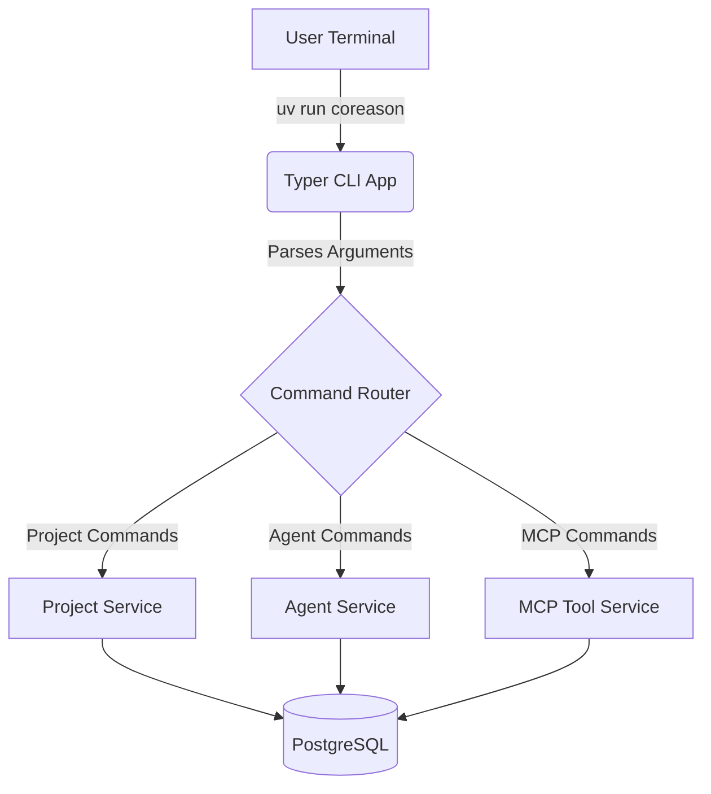

# Command Line Interface (CLI)

The CoReason Workspace Environment provides a fully-featured headless CLI built using **Typer**. 

Following the Multi-Surface Interaction Parity mandate, the CLI is a thin transport adapter over the shared `src.core.services` layer. Anything achievable via the REST API or Swagger UI is mathematically guaranteed to be achievable natively from the terminal. This ensures usability in air-gapped, CI/CD, and terminal-only execution environments.

> [!NOTE]
> To prove this execution equivalence, the CLI layer undergoes strict [Multi-Surface Parity Testing](../architecture/multi_surface_parity.md) within our Testcontainers CI suite.

## Architecture

The CLI acts as a synchronous entrypoint that maps user arguments to asynchronous background execution services via `asyncio.run()`.



## Available Commands

### 1. Building a New Platform
The core operation of the factory is building platforms using natural language intents.

```bash
uv run coreason build "I need an automated clinical trial matching agent platform" --output-dir ./dist
```
> [!NOTE]
> The `build` command spins up a temporary session UUID, delegates the text payload to the `OrchestrationService`, and writes the final exported ZIP artifact to `--output-dir`.

### 2. OCI Registry Operations
The platform is natively compatible with the OCI (Open Container Initiative) standard, allowing you to push and pull agent bundles directly to enterprise artifact registries (e.g. AWS ECR, GitHub Packages) exactly like Docker images.

**Pushing an Agent Bundle:**
```bash
uv run coreason push-project 01J18H1P9F2M1Q6N9B9Y6W4A2B "ghcr.io/my-org/my-agent:v1.0.0"
```

**Pulling an Agent Bundle:**
```bash
uv run coreason pull-project "My Imported Agent" "ghcr.io/my-org/my-agent:v1.0.0" --description "Imported from staging"
```

> [!TIP]
> **State Isolation Flags**: You can append `--skip-state` or `--skip-docker` to OCI operations if you only wish to transfer the raw logic without porting the Postgres checkpointer state or compiling a new Docker image.

### 3. Airgapped Export / Import
For high-security sovereign deployments, you can manually export projects to a physical `.zip` file for USB transfer.

**Export:**
```bash
uv run coreason export-project 01J18H1P9F2M1Q6N9B9Y6W4A2B ./my_bundle.zip
```

**Import:**
```bash
uv run coreason import-project "Airgapped Agent" ./my_bundle.zip
```

### 4. Inspection Commands
You can list active deployments and MCP servers directly from the terminal.

```bash
uv run coreason agents list
uv run coreason agents get --name project_initiation
uv run coreason mcp list-servers
```

### 5. Manual Agent Execution & Context Engineering
You can execute individual agents from the CLI. 

> [!WARNING]
> **Context Saturation Required**: Because the CoReason Workspace Environment adheres to the [Context Engineering Harness](../architecture/context_engineering.md), all commands sent via the CLI are evaluated by a State Machine Orchestrator for schema saturation. If your CLI payload is too ambiguous (e.g., `"Compile the agent"`), the execution will return early with `is_saturated: False` and demand more information. You must provide a highly detailed, saturated prompt to successfully trigger downstream builders.

```bash
uv run coreason agents execute "yaml_compiler" "Build a highly detailed platform that scrapes data..."
```
