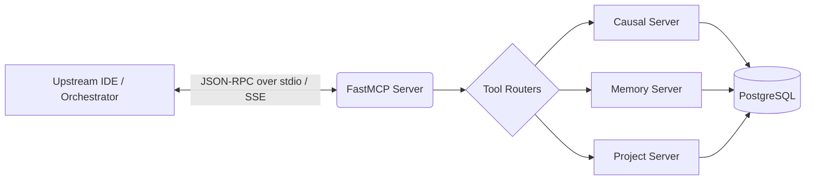

# Model Context Protocol (MCP)

Since the CoReason platform acts as an agent-building factory, it natively exposes itself as a **Model Context Protocol (MCP)** server. This allows upstream AI agents, IDEs (like Cursor or Windsurf), and parent orchestrators to interface with the factory natively.

The platform uses `FastMCP` to map its internal core services directly to standard MCP JSON-RPC schemas over `stdio` and `SSE`.

## MCP Architecture



## Inner Workings & Namespaces

The MCP Server groups tools logically into domains based on the underlying capabilities of the platform:

1. **Causal Server Tools**: Allows upstream agents to map causal relationships, build diagrams, and interact with the platform's reasoning engine.
2. **Memory Server Tools**: Provides access to the platform's internal knowledge base and state persistence.
3. **Project Tools**: Directly exposes the platform's `build`, `push-oci`, and `export` capabilities to upstream agents.

> [!IMPORTANT]
> Because the MCP Server binds to the exact same `src.core.services` layer as the REST API, any action an agent takes via an MCP tool call uses the same rigorous Pydantic validation and UUIDv7 logic as if a human invoked the REST endpoint. This is guaranteed by our [Multi-Surface Parity Testing](../architecture/multi_surface_parity.md).

## Usage Example (Configuration)

To connect an IDE or external orchestrator to the CoReason MCP Server using the `stdio` transport, add the following configuration to your `mcp.json` or `claude_desktop_config.json`:

```json
{
  "mcpServers": {
    "coreason_factory": {
      "command": "uv",
      "args": [
        "run",
        "coreason-mcp"
      ],
      "env": {
        "API_SECRET_TOKEN": "coreason-dev-token"
      }
    }
  }
}
```

Once connected, your agent will natively inherit tools such as `build_agent_platform`, `list_active_projects`, and `export_oci_bundle`.
