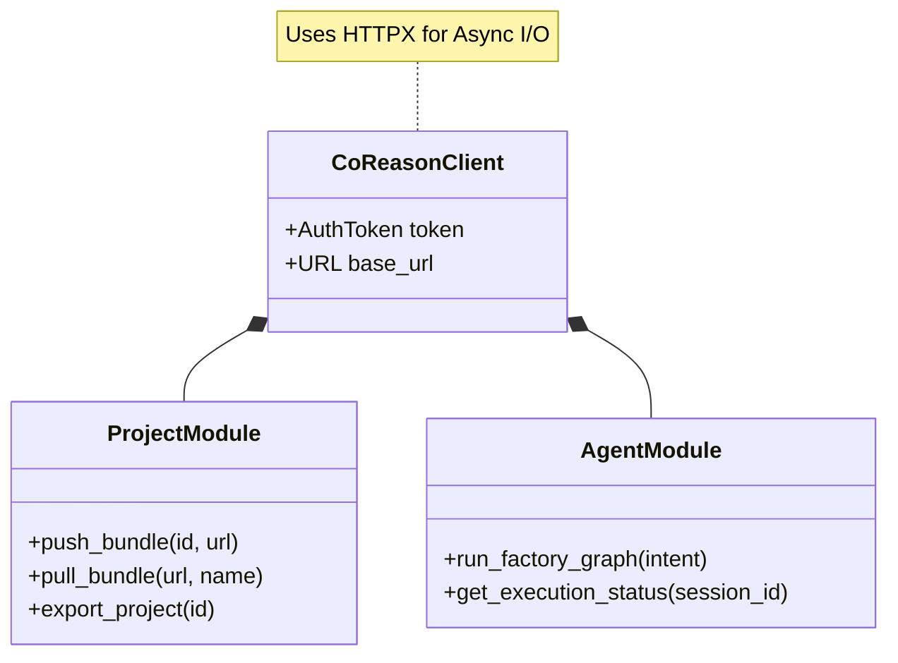

# Python SDK

The CoReason Workspace Environment exposes a pure-Python SDK for programmatic embedding (`import coreason`).

Because the SDK is simply an HTTP wrapper over the REST API via the `httpx` library, it inherits the exact same capability set and data schemas as the CLI and REST interfaces. 

> [!NOTE]
> This behavioral guarantee is actively validated by our [Multi-Surface Parity Testing](../architecture/multi_surface_parity.md) suite, which executes identical test workflows through the SDK against an ephemeral Testcontainers PostgreSQL database. 

## SDK Architecture



## Inner Workings

The `CoReasonClient` reads authentication variables directly from your environment (`API_SECRET_TOKEN` and `COREASON_BASE_URL`). 

When you invoke a method, the SDK automatically formats the Pydantic models (imported from `coreason_manifest`) into JSON, appends the Bearer Token, and dispatches the asynchronous HTTP request. It strictly returns native Python dictionaries or Pydantic models.

## Usage Example

To embed the platform's capabilities into an external Python script, orchestrator, or Airflow DAG, initialize the client and await the coroutines:

```python
import asyncio
from src.sdk.client import CoReasonClient

async def main():
    # Automatically picks up environment variables
    client = CoReasonClient()
    
    print("Pulling external agent bundle from OCI registry...")
    
    # 1. Pull the Bundle
    result = await client.projects.pull_bundle(
        oci_uri="ghcr.io/my-org/healthcare-agent:v1",
        name="Healthcare Agent",
        description="Downloaded via SDK"
    )
    
    if result.get("status") == "success":
        job_id = result.get("job_id")
        print(f"Background pull job initiated: {job_id}")
        
        # 2. Poll for completion
        while True:
            status = await client.projects.get_job_status(job_id)
            if status.get("state") == "COMPLETED":
                print("Project successfully imported!")
                break
            await asyncio.sleep(2)

if __name__ == "__main__":
    asyncio.run(main())
```

> [!CAUTION]
> The Python SDK relies on `asyncio`. Attempting to call these methods synchronously without `await` or `asyncio.run()` will result in Coroutine exhaustion errors.
