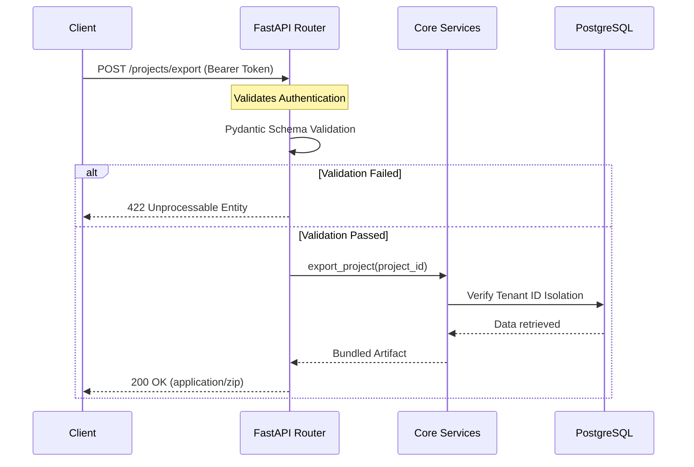

# REST API

The CoReason Workspace Environment exposes a comprehensive **FastAPI-powered REST API**. 

Following the platform's Multi-Surface Parity mandate, the REST API does not duplicate business logic. It serves strictly as a transport adapter over the shared `src.core.services` layer, ensuring that operations triggered via HTTP behave identically to those triggered via the CLI or MCP server.

> [!NOTE]
> To prove this execution equivalence, the REST API undergoes strict [Multi-Surface Parity Testing](../architecture/multi_surface_parity.md) alongside the other transport layers using an ephemeral Testcontainers database.

## Architecture & Validation Pipeline



## Pydantic Schema Purity

All API payloads, models, and responses are strictly governed by the `coreason-manifest` PyPI package. 

- **No Local Schemas:** The platform natively forbids the creation of local schema files (e.g., `ontology.py` or `state.py`). All Pydantic geometry is imported directly from the immutable `coreason_manifest`.
- **Zero-Trust Validation:** The FastAPI router relies on these strict Pydantic definitions to mathematically reject malformed payloads before they ever reach the execution layer, enforcing the Epistemic Firewall at the network edge.

> [!CAUTION]
> Bypassing Pydantic validation via raw JSON parsing is strictly prohibited in this repository. All API endpoints must declare their input body using a strict subclass of `CoreasonBaseState` from `coreason_manifest`.

## UUIDv7 Primary Keys

The REST API utilizes UUIDv7 natively for all database primary keys and session identifiers (e.g., `snapshot_id`, `project_id`). 

Because UUIDv7 incorporates a Unix epoch timestamp in its most significant bits, it prevents Postgres B-Tree index fragmentation while providing native chronological sorting. You should expect all API endpoints to return and require UUIDv7 strings.

## Multi-Tenant Security & State Isolation

Because the REST API operates in a multi-user environment, it natively enforces strict tenant data isolation. When a user authenticates, their `tenant_id` is passed securely to the execution layer. The API guarantees that operations like `get_status` and `export` actively filter Postgres queries using `AND tenant_id = $2`, preventing any possibility of data cross-contamination.

## Authentication

All platform endpoints (except `/health`) are strictly secured using Bearer Token authentication. Clients must provide a valid token in the `Authorization` header (`Authorization: Bearer <token>`). The expected token must match the `API_SECRET_TOKEN` environment variable configured on the server. If this environment variable is not explicitly set, the platform will fallback to the default local development token: `coreason-dev-token`. Requests missing a valid token will be rejected with a `401 Unauthorized` response.

### Example: Authenticated Request
```bash
curl -X GET "http://localhost:9005/projects" \
     -H "Authorization: Bearer $API_SECRET_TOKEN" \
     -H "Content-Type: application/json"
```

## Endpoints Overview

The API is fully self-documenting. When running the platform, you can view the Swagger UI at `http://localhost:9005/docs`. To test endpoints directly from the browser, click the "Authorize" button and input your `API_SECRET_TOKEN`.

### Core Router Spaces

#### 1. System Health (`/health`)
System and dependency health checks.
```bash
curl -X GET "http://localhost:9005/api/v1/health/"
```

#### 2. Project Management (`/projects`)
CRUD operations for agent projects. Includes air-gapped export endpoints (`/export`, `/import`), async OCI endpoints (`/push-oci`, `/pull-oci`), granular exports (`skip_state`, `skip_docker`), and background job polling (`/portability/jobs/{job_id}`).

**Exporting a Project (Airgap Ready):**
```bash
curl -X POST "http://localhost:9005/projects/export/01J18H1P9F2M1Q6N9B9Y6W4A2B" \
     -H "Authorization: Bearer $API_SECRET_TOKEN" \
     --output project_bundle.zip
```

#### 3. Agent Execution (`/agents`)
Agent execution, status polling, and definition retrieval.

#### 4. Real-time Streaming (`/streaming`)
HTTP-bound Server-Sent Events (SSE) and WebSocket upgrade endpoints for real-time observability. See the [WebSocket & SSE](websocket_sse.md) documentation for full implementation details.
