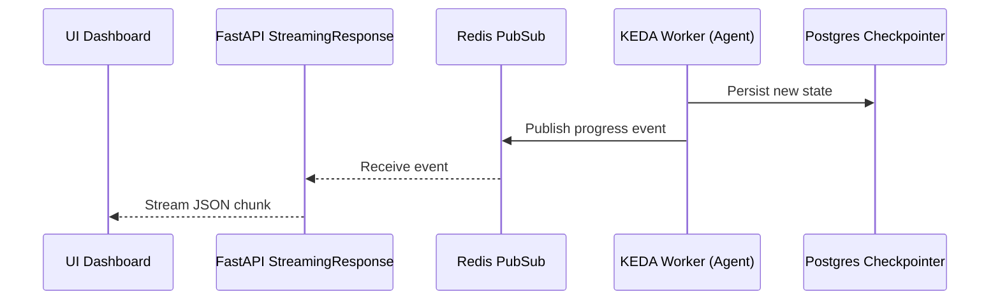

# WebSocket & Server-Sent Events (SSE)

The CoReason Workspace Environment heavily leverages real-time streaming to provide interactive observability into the long-running agent execution processes.

To satisfy the "Real-Time Observability & Accordion UX" rule, the platform exposes dedicated WebSockets and SSE streams.

## Streaming Architecture



## The Four Core Streams

All streams are located under the `/ws` routing prefix and require the same Bearer Token authentication as the REST API.

1. **`crdt` (Collaborative Editing)**: Emits real-time Operational Transformation (OT) or CRDT events, allowing multiple users (or agents and humans) to concurrently edit artifacts without conflict.
2. **`tty` (Terminal Passthrough)**: A raw bidirectional pipe that streams standard output and standard error from isolated Docker execution environments directly to the browser.
3. **`state_sync` (LangGraph State)**: Streams the immutable snapshot updates emitted by the LangGraph Postgres Checkpointer every time a node completes execution.
4. **`agent_progress` (Tracker Task List)**: Streams structural eventing messages. Agents maintain a structured tracker task list and emit summaries at key steps to populate the UI's Accordion view.

> [!TIP]
> **Why separate streams?** Separating streams by semantic meaning (e.g. raw TTY text vs. structured LangGraph state dictionaries) ensures that frontend clients can parse and render the payloads efficiently without complex multiplexing logic.

## Usage Example (JavaScript Client)

Because SSE operates over standard HTTP, connecting from a browser requires minimal boilerplate:

```javascript
const eventSource = new EventSource("http://localhost:9005/ws/agent_progress/01J18H1P9F2M1Q6N9B9Y6W4A2B", {
    headers: {
        "Authorization": "Bearer coreason-dev-token"
    }
});

eventSource.onmessage = function(event) {
    const data = JSON.parse(event.data);
    console.log(`Agent ${data.agent_name} completed task: ${data.task_name}`);
    
    // Update Accordion UI...
    updateAccordion(data);
};

eventSource.onerror = function(err) {
    console.error("EventSource failed:", err);
};
```
