```mermaid
graph TD
    Platform["CoReason AI Agent Building Factory"]
    
    Platform --> Pillar1["1. Agent Synthesis & Orchestrations"]
    Platform --> Pillar2["2. Identity, Governance & Cataloging"]
    Platform --> Pillar3["3. Execution, Sandboxing & Security"]
    Platform --> Pillar4["4. Multi-Surface Interoperability"]
    Platform --> Pillar5["5. Observability, Telemetry & Memory"]

    Pillar1 --> P1_1["1.1 PyAgentSpec Manifest Engine"]
    Pillar1 --> P1_2["1.2 Hierarchical Factory Supervision"]
    Pillar1 --> P1_3["1.3 Quine Template Transpiler"]
    Pillar1 --> P1_4["1.4 Dual-Tier A2A Protocol"]

    Pillar2 --> P2_1["2.1 IANA PEN 66197 URN Authority"]
    Pillar2 --> P2_2["2.2 Global Module Catalog"]
    Pillar2 --> P2_3["2.3 RBAC & Clearance Layer"]

    Pillar3 --> P3_1["3.1 OpenShell Zero-Trust Policies"]
    Pillar3 --> P3_2["3.2 Docker & Kubernetes Sandboxing"]
    Pillar3 --> P3_3["3.3 Secret & Connection Injection"]

    Pillar4 --> P4_1["4.1 5-Surface Transport Parity"]
    Pillar4 --> P4_2["4.2 Dify Enterprise Shell Integration"]

    Pillar5 --> P5_1["5.1 Ambient OTel Telemetry"]
    Pillar5 --> P5_2["5.2 Open-Source Langfuse Tracing"]
    Pillar5 --> P5_3["5.3 Postgres State Checkpointing"]
    Pillar5 --> P5_4["5.4 Episodic & Vector Memory"]
```

# Comprehensive System Capabilities Taxonomy (MECE Taxonomy)

This document provides a **Mutually Exclusive, Collectively Exhaustive (MECE)** taxonomy of all capabilities, architectural components, underlying technology stacks, and supporting codebase modules within the CoReason AI Agent Building Factory (`coreason-workspace-env`).

---

---

## 1. Agent Synthesis & Orchestrations (The Factory Engine)

### 1.1 PyAgentSpec & DeepAgent Manifest Engine
- **Capability**: Declarative Infrastructure-as-Code (IaC) agent definitions using versioned YAML manifests.
- **Tech Stack**: Python 3.14, `deepagents >= 0.6.12`, `pyagentspec`, `langchain-core`, `pydantic`.
- **Supporting Modules**: `src/agents/`, `src/core/base_agent.py` (`DeepAgent`).

### 1.2 Hierarchical Multi-Agent Supervision
- **Capability**: Multi-agent StateGraph coordination where supervisory agents plan, interrogate humans via structured 3-choice options, and delegate tasks to deterministic workers.
- **Tech Stack**: `LangGraph` (`StateGraph`), `create_deep_agent`, `deepagents` middleware.
- **Supporting Modules**: `src/agents/factory_ceo/`, `src/agents/agent_pm/`, `src/agents/yaml_compiler/`, `src/agents/librarian_pm/`, `src/agents/research_agent/`.

### 1.3 Self-Replicating Quine Template Transpiler
- **Capability**: Clones the platform's self-similar 5-surface runtime harness, mounts target agent manifests, binds tools, and packages deployable applications.
- **Tech Stack**: AES-256 AESGCM cryptography, PyYAML, Python `zipfile`/`tarfile`.
- **Supporting Modules**: `src/core/services/bundler_service.py` (`BundlerService.synthesize_project_template`).

### 1.4 Dual-Tier Agent-to-Agent (A2A) Protocol
- **Capability**: Loss-free intra-sandbox state graph delegation and authenticated inter-sandbox remote FastMCP tool calling.
- **Tech Stack**: `DeepAgentState` `TypedDict`, `Command(resume=...)`, `FastMCP`, `langchain_mcp_adapters`.
- **Supporting Modules**: `src/core/base_agent.py`, `src/mcp/server.py`.

### 1.5 Dynamic Tool & Skill Forging Engine
- **Capability**: Allows factory agents and human partners to forge new Python tools and markdown skills dynamically. Enforces a Maker-Checker validation gate where tools are executed against pytest unit tests in isolated sandboxes before being cleared.
- **Tech Stack**: Python `subprocess`, `pytest`, `ToolForgingService`, `SkillService`.
- **Supporting Modules**: `src/core/services/tool_forging_service.py`, `src/core/services/skill_service.py`.

### 1.6 Self-Similar Skill Registry & Cross-Project Skill Cloning
- **Capability**: Maintains self-similar skill registries across factory orchestrators and downstream synthesized agent applications. Enables agents to clone skills out to the PEN 66197 global catalog or clone existing catalog skills in.
- **Tech Stack**: Markdown YAML frontmatter, `CatalogService` PEN 66197 OID URNs (`urn:oid:1.3.6.1.4.1.66197:skill:...`).
- **Supporting Modules**: `src/core/services/skill_service.py`, `src/core/tools/catalog_tools.py`.

### 1.7 Deterministic Audit, Sandboxed Testing & Autonomous Improvement Services
- **Capability**: Enforces a strict Rule: Deterministic checks (arithmetic calculations, Python AST parsing, regex pattern matching, security credential scanning) must use deterministic Python tools instead of probabilistic LLM token outputs. Runs sandboxed pytest suites and autonomously refactors prompts, forges missing tools, or updates skills based on audit/test receipts.
- **Tech Stack**: Python AST (`ast`), `AuditService`, `TestingService`, `ImprovementService`, Validation Skills (`src/core/skills/validation/`).
- **Supporting Modules**: `src/core/services/audit_service.py`, `src/core/services/testing_service.py`, `src/core/services/improvement_service.py`.

---

## 2. Identity, Governance & Cataloging (The Knowledge & Identity Authority)

### 2.1 IANA PEN 66197 OID URN & URL Resolution Engine
- **Capability**: Universal registration, parsing, and resolution of global resource identifiers backed by Coreason AI's official IANA Private Enterprise Number assignment (66197).
- **Tech Stack**: RFC 3001 OID URN parser, URL resolution engine.
- **Form**: `urn:oid:1.3.6.1.4.1.66197:<resource_type>:<resource_id>` & `https://urn.coreason.ai/1.3.6.1.4.1.66197/<resource_type>/<resource_id>`.
- **Supporting Modules**: `src/core/ontology.py` (`CoreasonURN`).

### 2.2 Global Module Catalog & Import Service
- **Capability**: Indexes synthesized projects, agents, skills, and workflows; provides full-text search and module importation into new project spaces.
- **Tech Stack**: PostgreSQL B-Tree indexed catalog storage, `CatalogService`.
- **Supporting Modules**: `src/core/services/catalog_service.py`, `src/core/tools/catalog_tools.py`.

### 2.3 Pluggable RBAC & Authorization Layer
- **Capability**: Multitenant identity verification, role-based access control, and domain clearance enforcement.
- **Tech Stack**: Casbin rule enforcer, FastAPI route guards, `RBACService`.
- **Supporting Modules**: `src/core/services/rbac_service.py`, `src/api/endpoints/`.

---

## 3. Execution, Sandboxing & Security Boundaries (The Security & Runtime Engine)

### 3.1 OpenShell Process Boundary & Zero-Trust Policies
- **Capability**: Synthesizes agent-specific process boundary security manifests (`openshell.policy.json`) declaring read-only paths, network egress whitelists, allowed MCP servers, and capability controls.
- **Tech Stack**: OpenShell Policy Engine, JSON Schema validation.
- **Supporting Modules**: `src/core/services/sandbox_service.py` (`SandboxService`).

### 3.2 Container & Pod Isolation Engine
- **Capability**: Provisions Docker Compose overrides (`docker-compose.sandbox.yaml`) with `no-new-privileges:true` and Kubernetes Pod manifests (`k8s-pod.yaml`) with `readOnlyRootFilesystem: true`.
- **Tech Stack**: Docker Compose, Kubernetes API v1 Pod Spec.
- **Supporting Modules**: `src/core/services/sandbox_service.py`.

### 3.3 Secret Provisioning & Database Connection Binding
- **Capability**: Dynamically injects provisioned environment secrets (`.env.sandbox`), HashiCorp Vault tokens, and PostgreSQL/Redis connection strings into isolated sandboxes.
- **Tech Stack**: HashiCorp Vault API, PostgreSQL connection pools (`psycopg_pool`).
- **Supporting Modules**: `src/core/services/sandbox_service.py`.

---

## 4. Multi-Surface Interoperability & Client Adapters (The Transport Engine)

### 4.1 5-Surface Transport Parity
- **Capability**: 100% feature coverage across all 5 interaction surfaces without duplicating core business logic.
- **Surfaces & Technologies**:
  - **REST API**: FastAPI, Uvicorn (`src/api/`).
  - **CLI**: Typer (`src/cli/`).
  - **MCP Server**: FastMCP JSON-RPC (`src/mcp/`).
  - **WebSockets / SSE**: Async SSE streaming (`src/api/streaming/`).
  - **Python SDK**: `CoReasonClient` in-process binding (`src/sdk/`).
- **Supporting Modules**: `src/api/`, `src/cli/`, `src/mcp/`, `src/sdk/`.

### 4.2 Dify Enterprise Shell Integration
- **Capability**: Connects self-hosted Dify enterprise chat interfaces to CoReason backend capabilities via FastMCP tool server integration.
- **Tech Stack**: Dify MCP Plugin Adapter, FastMCP SSE with Bearer authentication.
- **Supporting Modules**: `src/mcp/server.py`, `docs/dify_deployment.md`.

---

## 5. Observability, Telemetry & Memory Persistence (The Operations Engine)

### 5.1 Zero-Waste Ambient Telemetry
- **Capability**: Ambient Request-Scoped tracing without memory leaks or custom `weakref` boilerplate.
- **Tech Stack**: OpenTelemetry Context (`opentelemetry.context`), Structlog ContextVars (`structlog`).
- **Supporting Modules**: `src/core/telemetry.py`.

### 5.2 Open-Source Tracing & Evaluation
- **Capability**: 100% open-source local tracing, LLM prompt/completion tracking, and evaluation loops without SaaS lock-in.
- **Tech Stack**: Langfuse Open-Source (`harbor up langfuse`), `LangfuseCallbackHandler`.
- **Supporting Modules**: `src/core/services/trace_service.py`.

### 5.3 State Checkpointing & Time Travel
- **Capability**: Thread state persistence and execution thread resumption.
- **Tech Stack**: `AsyncPostgresSaver`, `langgraph-checkpoint-postgres`.
- **Supporting Modules**: `src/core/services/agent_service.py`.

### 5.4 Episodic & Semantic Memory Engine
- **Capability**: Cross-session long-term memory retrieval and vector similarity search across historical project execution runs.
- **Tech Stack**: Qdrant Vector Database, OpenAI Embeddings, PostgreSQL memory tables.
- **Supporting Modules**: `src/core/services/memory_service.py`.
