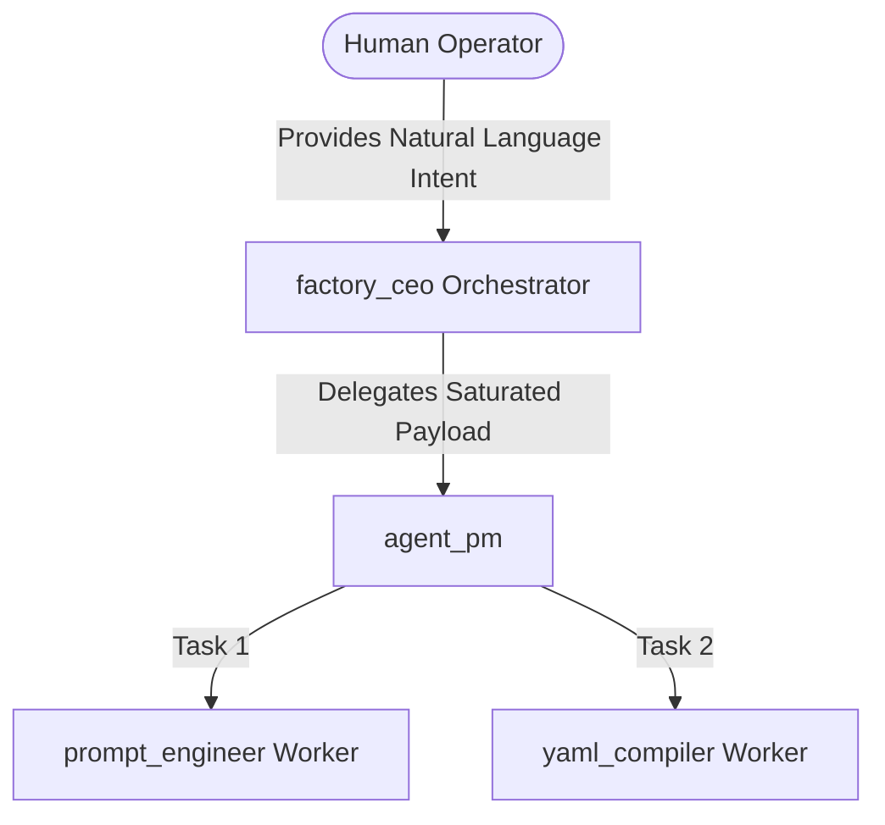

# User Guide: The Factory Workflow

As an operator of the CoReason Workspace Environment, your primary role is to act as the visionary and stakeholder. The heavy lifting of software engineering and agent orchestration is delegated to your internal hierarchy of factory agents.

This guide outlines the complete 10-step real-world workflow used to build, validate, and deploy a brand new agent platform natively with `deepagents`.

## The DeepAgent Hierarchy

Before diving into the steps, it is essential to understand the organizational structure of the factory you are commanding:



---

## 10-Step Operational Workflow

### Step 1: Initialization & Intent Declaration
You initiate the workflow using the headless CLI, REST API, or the UI Dashboard. You provide your core intent in natural language.

**Example using the CLI:**
```bash
uv run coreason build "I need an automated clinical trial matching agent platform"
```

### Step 2: The Interrogation Loop (Context Saturation)
Instead of blindly writing code, the `factory_ceo` orchestrator agent intercepts your request. Because it operates as a rigid state machine, it will evaluate your input against its required internal context schema. If it needs more details (e.g., "What specific databases should it query?"), it will stream clarifying questions back to you in the UI. You answer until the context is fully saturated.

### Step 3: PM & Worker Delegation
Once the context threshold is met, the `factory_ceo` stops interrogating you. It automatically delegates the raw context payload to the `agent_pm`. The PM breaks the project down into component tasks and routes them to standard native DeepAgent workers, such as the `prompt_engineer` and `yaml_compiler`. 

### Step 4: The Factory Floor (Drafting Artifacts)
The worker agents execute deterministically in the background. They do not ask you questions. Using the shared skills library (`src/core/skills/building/`), they construct the necessary artifacts: Python nodes, tool integrations, and agent YAML definitions strictly bound by the DeepAgent pattern.

### Step 5: Artifact Finalization
Instead of using brittle AST parsers and a legacy Maker-Checker pipeline, the artifacts are generated natively through LangGraph StateGraph nodes. The system verifies Pydantic compliance and native checkpointer synchronization natively within the `deepagents` middleware.

### Step 6: The Remediation & Approval Loop
If a worker encounters an integration error, the `agent_pm` actively routes the artifact back for remediation. You can observe this loop in real-time via the SSE `state_sync` streams or the Accordion tracker list in the UI.

### Step 7: Packaging & Artifact Synthesis
Once all artifacts are generated and finalized, the platform generates a dynamically synthesized `pyproject.toml` containing exactly the dependencies your new agents need. It packages the raw Python code and `.yaml` manifests into an immutable ZIP bundle.

### Step 8: OCI Push & Airgap Export
You now have a completed platform. You can export it locally for an air-gapped deployment, or push it straight to your enterprise registry (e.g., AWS ECR) using the standard OCI (Open Container Initiative) commands.

**Pushing to an OCI Registry:**
```bash
uv run coreason push_project <project_id> ghcr.io/my-org/trial-agent:v1.0.0
```

### Step 9: Downstream Deployment
You switch hats from "Creator" to "Operator". You pull your newly compiled agent platform onto your target server, unzip it, and run `uv run coreason dev` (or deploy via Docker). Your custom agents are now alive and exposing their own MCP/REST endpoints!

### Step 10: Feedback & Iteration
As you test your deployed agents, you will discover new features you want or edge cases you missed. You simply open a new session in the CoReason Workspace Environment, point it at your deployed project, and converse with the `factory_ceo` to ingest the new requirements and spin the factory floor back up for version 2.0.
