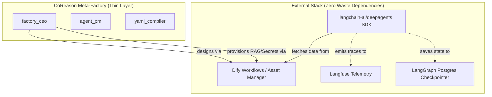

# Zero Waste Architecture & Dependency Map

## Executive Summary
CoReason Workspace Environment (`coreason-workspace-env`) operates on a strict **Zero Waste** philosophy. We do not write or maintain custom code for capabilities that exist in stable, open-source external stacks. CoReason is a thin, opinionated meta-agent factory layer that orchestrates highly mature external systems to execute the Agent Development Lifecycle (ADLC).

## Core Dependencies (The Stack)

### 1. Execution Harness: `langchain-ai/deepagents`
**Status:** Canonical Source of Truth for all runtime logic.
**What we delegate:**
- Agent execution routing (StateGraphs).
- Subagent delegation (`subagents.py` middleware).
- Conversation history and context window limits (`memory.py` & `summarization.py` middleware).
- Tool execution security (`permissions.py` middleware).
- Evaluation and testing (`deepagents/libs/evals`).
**What we deleted:** All custom orchestrators (`src/core/services/orchestration_service.py`), custom execution loops, and custom testing harnesses.

### 2. Visual Design UI & Orchestration: Dify Workflows
**Status:** Primary Workflow Orchestrator & Visual UI.
**What we delegate:**
- Visual node-graph canvas via Dify Workflows.
- Main execution flow orchestration (replacing custom Python routers).
- LLM Provider secret key encryption and vault management.
- Document parsing, chunking, and RAG vector dataset indexing.
- Prompt evaluation playground.
- Web App Publishing (UI portal).
- Multi-tenant workspaces and user accounts (Macro-RBAC).
**What we deleted/bypassed:**
- CoReason's custom database schemas (`src/core/db.py`).
- CoReason's custom project tracking (`src/core/services/project_service.py`).
**Integration Strategy:** Dify acts as the primary orchestrator. Specialized local execution is handled by `deepagents` Python scripts, which Dify triggers via its native Code nodes or External API tool nodes.

### 4. Observability: Langfuse
**Status:** Centralized Telemetry Hub.
**What we delegate:**
- Local tracing, span collection, and token counting (via native `langfuse-langchain`).
**What we deleted/bypassed:**
- CoReason's custom observability wrappers (`src/core/services/observability_service.py`).
- Dify's internal analytics database.

## Architecture Topology

## Deprecation & Deletion Roadmap

To enforce Zero Waste, the following legacy CoReason components are slated for immediate deletion:

1. **`src/core/db.py` & Custom SQL Models**: 
   - *Reason*: Dify Postgres handles business models; LangGraph handles agent state.
2. **`src/core/services/project_service.py`**:
   - *Reason*: Dify handles multi-tenant workspace isolation.
3. **`src/core/services/orchestration_service.py`**:
   - *Reason*: The `deepagents` SDK provides native graph orchestration (`create_deep_agent`).
4. **`src/core/services/observability_service.py`**:
   - *Reason*: Rely completely on `langfuse-langchain` native callbacks.
5. **`src/core/services/portability_service.py`**:
   - *Reason*: Redundant with Dify App DSL exports.
